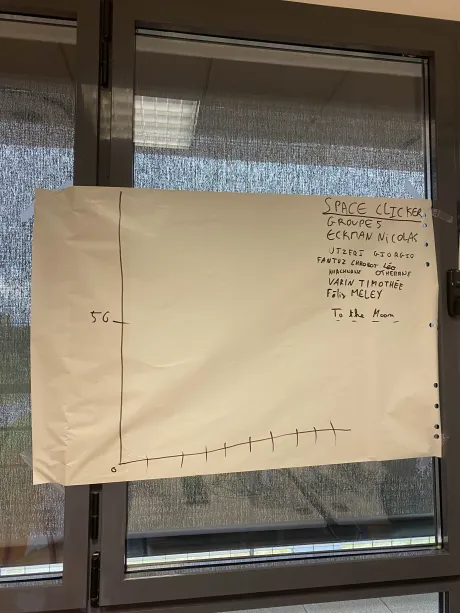
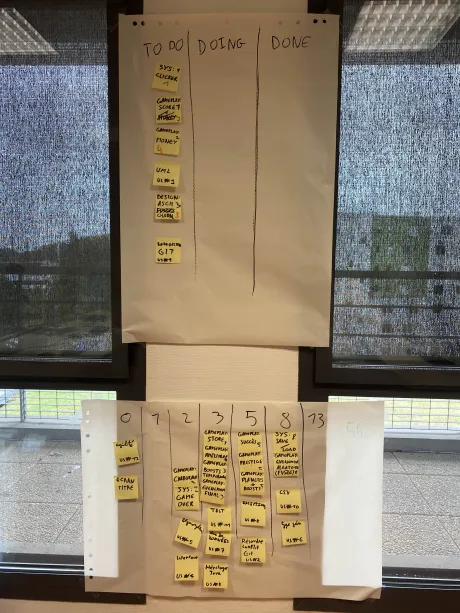

# Sprint 0

## Démo + Planification du sprint suivant
Pour l'instant, notre projet n'est pas fonctionnel, car il s'agit là d'un sprint de réflexion. Cependant, nous avons prévu d'ajouter les points principaux de notre projet durant le prochain sprint.

### Ce que nous avons fait durant ce sprint
Durant ce sprint, nous avons posé les fondations de notre projet. Nous avons défini les grandes lignes de notre projet et les fonctionnalités que nous voulons implémenter. Nous avons également défini le titre et le slogan du projet.

Nous avons ainsi défini notre burn-up à l'échelle de notre nombre de sprint total ainsi que le nombre de points maximal possible. Nous avons également défini notre BackLog en placant des posts-it représantant nos US, ainsi triés selon leur difficulté et priorité. Nous avons ainsi ajouté un tableau "To Do | Doing | Done" afin d'établir les US qui doivent être faites pendant le prochain sprint, ainsi que les US en cours de développement et pour finir les US terminées.

### Ce que nous allons faire durant le prochain sprint
Lors du prochain sprint, nous commencerons à implémenter les fonctionnalités essentielles de notre projet et une partie de l'interface graphique. 
Nous allons ainsi implémenter le principe du jeu à savoir le clicker, ainsi que l'argent du joueur, son score et la préparation de l'affichage avec la réalisation de fichier design ascii. Nous allons également réaliser l'UML du projet.

## Rétrospective
Nous avons assez bien établi les idées principales de notre jeu. Nous avons travaillés efficacement sur la réflexion concernant ce dernier.

### Sur quoi avons nous butté ?

Les bases ont été posées efficacement, toutes les fonctionnalités ont été réfléchies et mises sur papier. Cependant, il est vrai que certaines idées étaient floues donc modifiées plusieurs fois, nous ralentissant un peu.
Certains membres de l'équipe étaient un peu impatients à l'idée de concevoir le projet.
Etant donné que les tâches n'étaient pas encore rédigées, certains membres de l'équipe ont eu du mal à se concentrer.

### PDCA

Nous allons utiliser le système de post-it afin de mieux organiser les tâches et les prioriser.
Grâce à cela, nous pourrons mieux nous concentrer sur les tâches à réaliser et ne pas nous disperser.
L'indicateur qui nous indiquera si nous avons réussi à résoudre ces problèmes sera le burn-out.

